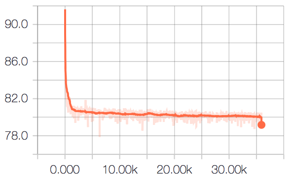

# HumanRecognition

## Usage
+ get dataset

	```
	./scripts/get_PIPA.sh
	```

+ get models

	```
	./scripts/get_models.sh
	```
+ extract CPM pose

	```
	python pyHumanRecog/extract_pose.py <img_dump_folder> <pose_dump_folder>
	```
	`<image_dump_folder>`: folder to dump CPM pose visualization images

	`<pose_dump_folder>`: folder to dump CPM pose positions
	
+ train body feature extractor

	(feel free to increase the batch\_size for better performance)
	
	```
	python pyHumanRecog/train_body_feature_extractor.py --batch_size 32
	```
		
+ test body feature extractor

	```
	python pyHumanRecog/test_body_feature_extractor.py --batch_size 32
	```
